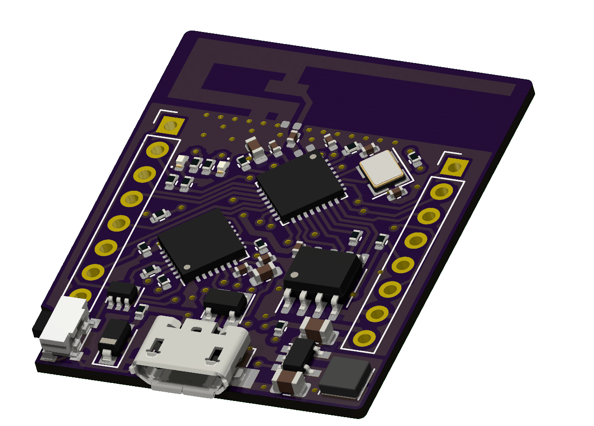

# ESP8266 NeatBoard

Small clone of WeMos D1 Mini couple additional functionalities:
- Pin-out and footprint compatible with WeMos D1 Mini (exception: board outline)
- Additional jumpers for Deep Sleep and disabling LEDs
- CP2102 USB-UART bridge (no more problems with CH340)
- UART activity LED
- DC/DC instead of LDO for better efficiency
- Bigger PCB antenna, based on DN007 document from Texas Instruments
- Integrated Fuse and ESD protection

Board was tested on 1.0mm 2-layer stackup. Matching was not verified with VNA. Components used to built couple units were taken from ESP-01 boards, so there is possibility to use other values (LEDs, SPI Flash etc.)

Gerber files (both old, tested version and new, regenerated in KiCad 8), Schematic and Interactive BOM (missing MPNs) are present in `production-files` folder.

After assembly, board should work without any additional steps, just like D1 mini or similar. 

## License
MIT
